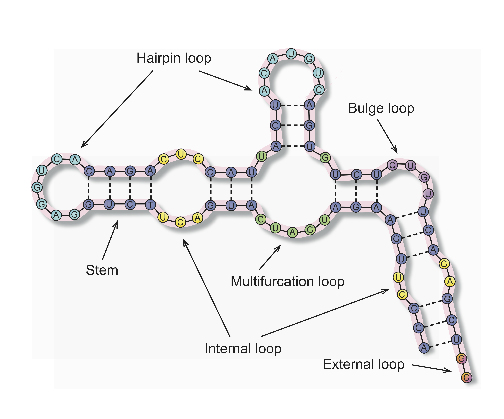

# RNAsselem

RNAsselem is a Python package for analyzing RNA secondary structure elements in viral genomes, which includes the recognition of common secondary structure patterns, the generation of descriptive statistics for these structural elements, and the provision of their basic properties. 

## Installation

`pip install git+https://github.com/KazanovLab/RNAsselem.git#egg=RNAsselem`

## Features

* convertion from dot-bracket or CT format to WUSS format
* calculation of statistics on the pairing and unpairing of nucleotides
* calculation of statistics on genome coverage by different types of structural elements; 
* generation a list of structural elements of a particular type with information on position and size, including hairpin loops, internal loops, bulges, and multifurcation loops; 
* calculation of statistics on structural elements of a given type, providing a frequency of occurrence in the genome, as well as compiting the mean, median, standard deviations of the element size, and the total length of the elements in the genome.

## Quick start

Convert CT file to WUSS file:

```
import rnasselem as r
r.ct2wuss("/path/to/ct/file","/path/to/wuss/file")
```

Convert CT file to CT-WUSS file (CT file with an additional column containing WUSS notation):

```
import rnasselem as r
r.ct2ctwuss("/path/to/ct/file","/path/to/wuss/file")
```

Load CT-WUSS file for further processing:
```
import rnasselem as r
ctwuss_file = r.load_ctwuss("/path/to/ctwuss/file")
```

Get the list of hairpin loops in the genome:
```
import rnasselem as r
ctwuss_file = r.load_ctwuss("/path/to/ctwuss/file")
hairpin_list = get_hairpin_loop_list(ctwuss_file)
```

Get statistics on hairpin loops in the genome:
```
import rnasselem as r
ctwuss_file = r.load_ctwuss("/path/to/ctwuss/file")
hairpin_stat = get_hairpin_loop_stat(ctwuss_file)
print(stat)
{'count': 231, 'mean_length': 8.48, 'median_length': 7, 'std_length': 6.24, 'total_length': 1958}
```

Get and save statistics on all structural elements in the genome:
```
import rnasselem as r
r.save_stat("/path/to/ctwuss/file","/path/to/output/file")
```

Content of the file with the saved statistics:

|Structural element|Count|Mean_length|Median_length|Std_length|Total_length|
|------------------|-----|-----------|-------------|----------|------------|
|External_loops|84|8.01|5.0|10.31|673|
|Hairpin_loops|231|8.48|7|6.24|1958|
|Internal_loops|194|6.66|5.0|5.44|1293|
|Bulge_loops|114|1.8|1.0|2.04|205|
|Multifurcation_loops|62|28.97|24.0|19.04|1796|
|Stems|535|4.48|4|2.49|4798|


## Reporting Bugs and Feature Requests
Please use the [GitHub issue tracker](https://github.com/KazanovLab/RNAsselem/issues) to report bugs or suggest features.

## Citing
to be submitted